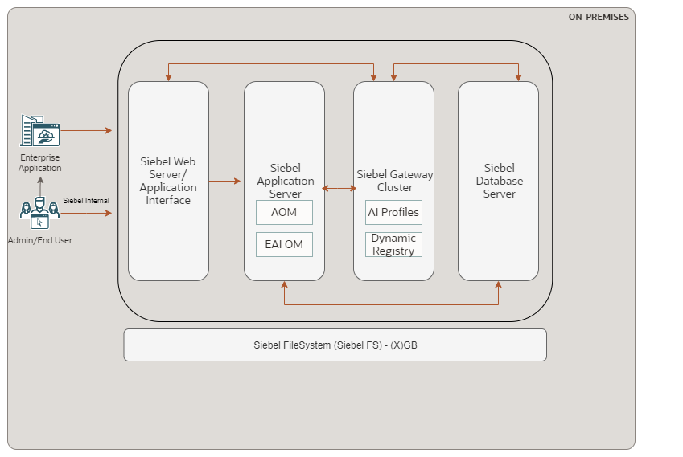
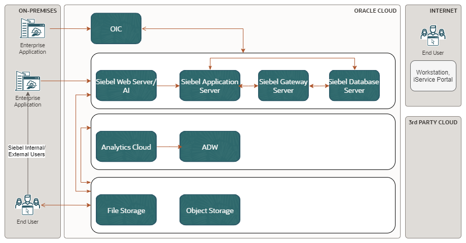
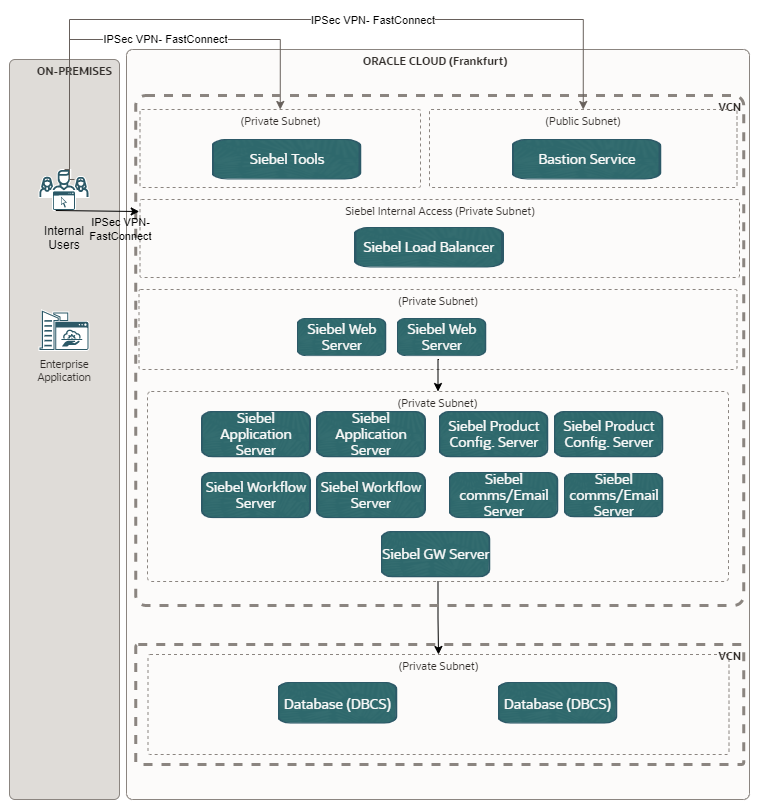
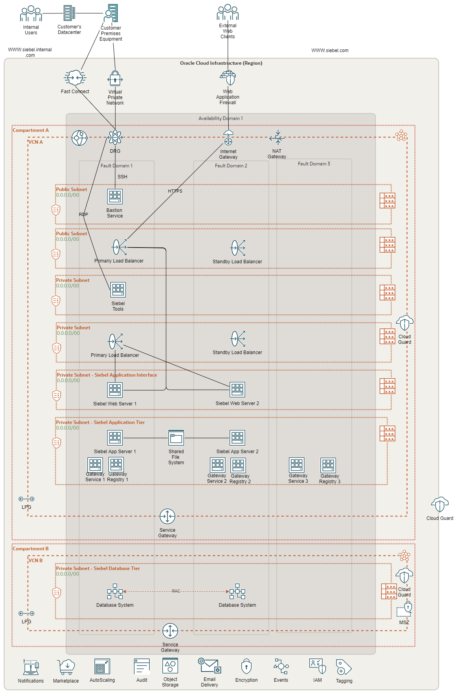

---
doc:
  author: Name, Surname 
  version: 0.1
  cover:
    title:
      - ${doc.customer.name}
      - Siebel to OCI
    subtitle:
      - Solution Definition
  customer:                             
    name: CustomerName                           
    alias: CustomerAlias                          
  config:
    impl:
      type: \<Service Provider\>            # Can be 'Oracle Lift', 'Oracle Fast Start', 'Partner' etc. Use with ${doc.config.impl.type}     
      handover: ${doc.customer.name}    # Please specify to whom to hand over the project after implementation. eg.: The Customer, a 3rd party implementation or operations partner, etc.           
  history:
    - version: 0.1
      date: Aug 2023 
      authors: 
        - ${doc.author} 
      comments:
        - First draft
  team:
    - name:	${doc.author}  
      email:	 example@example.com 
      role:	 Solution Specialist 
      company: Oracle
  acronyms:
    Dev: Development
---

<!--
    Last Change: 8 Aug 2023
    Review Status: draft
    Based on WAD Template Version: 1.2
-->
# Document Control

*Guide:*

*The first chapter of the document describes the metadata for the document. Such as versioning and team members.*

## Version Control

*Guide:* 

*A section describing the versions of this document and its changes.*

*Example:*

| Version | Authors | Date   | Comments      |
|---------|---------|--------|---------------|
| 0.1     | Name    | Aug 23 | initial draft |

## Team

*Guide:*

*A section describing the Oracle team.*

*Example:*

| Name  | Email | Role | Company |
|-------|-------|------|---------|
| name  | email | role | company |

## Document Purpose

*Guide:*

*Describe the purpose of this document and the Oracle-specific terminology, specifically around 'Workload'.*

This document provides a high-level solution definition for the Oracle solution and aims at describing the current state and to-be state

The document may refer to a 'Workload', which summarizes the full technical solution for a customer (You) during a single engagement. The Workload is described in chapter [Workload Requirements and Architecture](#workload-requirements-and-architecture). 

This is a living document, additional sections will be added as the engagement progresses resulting in a final workload architecture to be handed over at the end of the customer engagement. Where Oracle Lift is involved, certain sections will only be completed after customer acceptance of the content of the Workload Architecture document as it stands at the time acceptance is requested.

\pagebreak
# Business Context

*Describe the customer's business and background. What is the context of the customer's industry and LoB? What are the business needs and goals which this Workload is an enabler for? How does this technical solution impact and support the customer's business goals? Does this solution support a specific customer strategy, or maybe certain customer values? How does this solution help our customers to either generate more revenue or save costs?*

CUST_NAME is a INDUSTRY_NAME company operating in COUNTRY_NAME and on the international markets, providing services to consumers, businesses and the public sector.

Oracle Siebel is the strategic platform for B2B/B2C sales and marketing activities called "XYZ". Siebel implementation has performance issues with the Remote Product Configurator. Assessment has been done by ACS to perform some configuration changes.

## Executive Summary

*Guide:*

*A section describing the Oracle differentiator and key values of the solution of our solution for the customer, allowing the customer to make decisions quickly.*

The complete scope of the Workload is to deliver a future state architecture that migrates **WHAT** environments to OCI. 

Oracle Cloud Infrastructure (OCI) was designed specifically to support workloads like Siebel. By further migrating CUST_NAME Siebel workload to more OCI services it will allow them to enjoy improved efficiency, cost savings, and performance gains compared to on-premises deployments and other Cloud vendors, along with the elasticity and agility of the Cloud.

## Workload Business Value

*Guide:*

*A clear statement of specific business value as part of the full workload scope. Try to keep it SMART: Specific, Measurable, Assignable, Realistic, and Time-Related - Agree on the business value with the customer. Keep it business-focused, and speak the language of the LoB which benefits from this Workload: "Increase Customer Retention by 3% in the next year" or "Grow Customer Base with Executive Decision-Making from our Sales and Support Data". Avoid technical success criteria such as "Migrate App X to Oracle Cloud" or "Provision 5 Compute Instances". Avoid Oracle success criteria and language "Get Workload Consuming on OCI".*

The workload addresses the following key concerns:

1. Improve Siebel Performance and response time leveraging a modern cloud infrastructure.
2. Ensure that the Siebel application can scale up to the real time transaction processing volume.
3. Leverage OCI capabilities such as auto-scaling & enhance infrastructure availability, security and resilience.
4. Environment consistency/availability and rapid in-place technology refreshes, patching and updates.

There is an opportunity for the Oracle Cloud Infrastructure to help assist and support this transition to a new environment by providing additional deployment options. The advantages of using the Oracle Cloud include:

- Resolution of performance issues on existing on-premise deployment.
- Considerable reduction in the time it takes to provision new environments on the existing infrastructure.
- Potential cost savings in moving to the Oracle Cloud.
- Ability to utilize existing Oracle Cloud Credits.
- Availability of multiple different compute shapes that can be used to provide maximum performance at the lowest cost.
- Option to fine tune consumption e.g. by shutting-down non-production environments when not needed such as evenings and weekends.

**More business value Examples**
- Siebel database tier will be using a long term supported database and might even leverage Autonomous Database
- Siebel application tier will benefit from the "pay as you go" UCM model
- Siebel application will benefit from the Siebel architecture on OCI leveraging the Siebel Cloud Manager and docker containers
- Automation may be put in place for environments creation, Siebel updates and DevOps
- OCI cost monitoring will be available for use for the complete Siebel environment
- Moving Siebel to OCI may be conducive to broader data centre exit initiatives

The success implementation of this project is to:

1. Deliver Oracle Siebel CRM running on OCI in the specified architecture for the "Stress Testing Environment".
2. Deliver the specified environments in such a way that CUST_NAME on-premise applications and other third party systems can be successfully and integrated.
3. Deliver the To-Be architecture with the Terraform scripts to be used for other environments.

# Workload Requirements and Architecture

## Overview

*Guide:*

*Describe the Workload: What applications and environments are part of this Workload migration or new implementation project, and what are their names? The implementation will be scoped later and can be a subset of the Solution Definition and proposed overall solution. For example, a Workload could exist of two applications, but the implementer would only include one environment of one application. The workload chapter is about the whole Workload and the implementation scope will be described late in the chapter [Solution Scope](#solution-scope).*

The SIEBEL workload described in this document documents an Oracle Cloud Infrastructure (OCI) solution which replicates CUST_NAME existing on-premises Oracle Siebel implementation.

CUST_NAME is currently running Siebel **specify version** with database **specify version**. / **specify for all Environments**

**describe other features of the customer workload - example areas:**

- Customization complexity, java, siebel tools...etc.
- Application modules - Siebel Loyalty, Siebel Smart Answers etc.
- Connectivity - on-premises, Internet
- Disaster Recovery

## Non Functional Requirements

*Guide:*

*Describe the high-level technical requirements for the Workload. Consider all sub-chapters, but decide and choose which Non-Functional Requirements are necessary for your engagement. You might not need to capture all requirements for all sub-chapters.*

*This chapter is for describing customer-specific requirements (needs), not to explain Oracle solutions or capabilities.*

### Regulations and Compliances

*Guide:*

*This section captures specific regulatory or compliance requirements for the Workload. These may limit the types of technologies that can be used and may drive some architectural decisions.*

*The Oracle Cloud Infrastructure Compliance Documents service lets you view and download compliance documents:
https://docs.oracle.com/en-us/iaas/Content/ComplianceDocuments/Concepts/compliancedocsoverview.htm*

*If there are none, then please state it. Leave the second sentance as a default in the document.*

*Example:*

At the time of this document creation, no Regulatory and Compliance requirements have been specified.

In addition to these requirements, the [CIS Oracle Cloud Infrastructure Foundation Benchmark, v1.2](https://www.cisecurity.org/benchmark/Oracle_Cloud) will be applied to the Customer tenancy.

### Environments

*Guide:*

*A diagram or list detailing all the required environments (e.g. development, text, live, production, etc).*

*If you like to describe a current state, you can use or add the chapter 'Current Sate Architecture' before the 'Future State Architecture'.*

CUST_NAME Siebel **version** environments:

Name | Size of Prod | Location | MAA | Scope
:--- |:--- |:--- |:--- |:---
Dev & Test | 25% | Dubai | None | OCI Workload Migration
DR | 50% | Amsterdam | None | OCI Workload  |   |   |   |

### High Availability and Disaster Recovery Requirements

*Guide:*

*This section captures the resilience and recovery requirements for the Workload. Note that these may be different from the current system.*

*The Recovery Point Objective (RPO) and Recovery Time Objective (RTO) requirement of each environment should be captured in the environments section above, and wherever possible.*

- *What are the RTO and RPO requirements of the Application?*
- *What are the SLAs of the application?*
- *What are the backup requirements*

*Note that if needed, this section may also include an overview of the proposed backup and disaster recovery proposed architectures.*

*This chapter is mandatory, while there could be no requirements on HA/DR, please mention that in a short single sentence.*

*Example:*

At the time of this document creation, no Resilience or Recovery requirements have been specified.

### Security Requirements

*Guide:*

*Capture the Non-Functional Requirements for security-related topics. Security is a mandatory subsection that is to be reviewed by the x-workload security team. The requirements can be separated into:*
- *Identity and Access Management*
- *Data Security*

*Other security topics, such as network security, application security, key management or others can be added if needed.*

*Example:*

- Is there any Single Sign On or Active Directory Integration Requirement?
- Is the OS hardened if so please share the hardening guide line?
- What is the data classification?

## Current State Architecture
*Guide:*
*Provide a high-level logical description of the Workload current state. Stay in the Workload scope, show potential integrations, but do not try to create a full customer landscape. Use architecture diagrams to visualize the current state. We recommend not putting lists of technical resources or dependencies here. Refer to attachments instead.*

- Logical representation of the current Siebel estate architecture in the scope of business needs and current IT estate. Usually showing business flows and capabilities with high-level data flows and user interactions

- Include a diagram using the logical architecture notation or any on-premises architecture artifacts provided by Customer

- Include any available diagrams such as current networking architecture.

- Current Siebel environment details (current Production and non-Production environments)

Description of the current Siebel environment

  - Integration (with SaaS, other 3rd party applications like Genesys, Billing, core banking)
  - Authentication (SSO, interface with Oracle Access Manager, LDAP like OID or Microsoft AD etc)
  - Shared File System with other environments if any (with other non-production environment or 3rd party applications)

OR

The following information has been provided from answers to the Discovery Questionnaire:

*Example:*

_Database Tier_

- Database Version: 12.1.0.2.0
- Source Operating System Version and Release: Oracle Linux Server release 7.9
- Database size (in GB): 280
- DB Character set on source: AL32UTF8
- Oracle RAC configured: No
- Disaster recover plan/solution in place? No

_Siebel Application Tier_

- Oracle Siebel Version: IP15
- Source Operating System Version and Release: Oracle Linux Server release 7.9
- Number of application nodes: Single Node
- What languages other than English are installed on Siebel, if any? None
- Load balancer implemented ? Yes, F5
- DMZ setup or any external tiers: No
- Single Sign On implemented: No
- SSL implemented: Yes, terminated at F5 load balancer
- Siebel is integrated with any other Oracle Products like OBIEE/SOA/IDM...etc.

## Future State Architecture

*Guide:*

*The Workload Future State Architecture can be described in various forms. In the easiest case, we describe a Logical Architecture, possibly with a System Context Diagram. A high-level physical architecture is mandatory as a description of your solution.*

*This should be the final architecture as part of the pre-sales solution, not an intermediate or draft version*

*Additional architectures, in the subsections, can be used to describe needs for specific workloads.*

### Mandatory Security Best Practices

*Guide:*

*Use this text for every engagament. Do not change. Aligned with the Cloud Adoption Framework*

### OCI Secure Landing Zone Architecture

*Guide:*

*This chapter describes landing zone best practices and usually does not require any changes. If changes are required please refer to [landing zone confluence](https://confluence.oraclecorp.com/confluence/x/GZ-VHQE). The full landing zone needs to be described in the Solution Design by the service provider.*

*Use this section ONLY for new cloud deployments and remove for brown field deployments.*

### Physical Architecture

*Guide:*

*The Workload Architecture is typically described in a physical form. This should include all solution components. You do not have to provide solution build or deployment details such as IP addresses.*

*Please describe the solution as a written text. If you have certain specifics you like to explain, you can also use the Solution Consideration chapter to describe the details there.*

*[The Oracle Cloud Notation, OCI Architecture Diagram Toolkits](https://docs.oracle.com/en-us/iaas/Content/General/Reference/graphicsfordiagrams.htm)*

\newpage

\pagebreak

\pagebreak

\pagebreak

\pagebreak

\pagebreak

\pagebreak

\pagebreak

## Solution Considerations

*Guide:*

*Describe certain aspects of your solution in detail. What are the security, resilience, networking, and operations decisions you have taken that are important for your customer?*

### High Availability and Disaster Recovery 

*Reference:*
[Learn about deploying Siebel CRM on Oracle Cloud Infrastructure](https://docs.oracle.com/en/solutions/learn-architecture-deploy-siebel/index.html#GUID-B1AF5BE2-7BB9-402A-A57C-5E9AE752244D)

### Security
<!-- [Security Snippets](https://orahub.oci.oraclecorp.com/emea-workloadarchitecture/wad-snippets/-/tree/main/snippets/security/security-design/sec) -->

*Guide:*

*Please describe your solution from a security point of view. Generic security guidelines are in the Annex chapter.*

### Networking

## Sizing and Bill of Materials
<!--
Price Lists and SKUs / Part Numbers: https://esource.oraclecorp.com/sites/eSource/ESRCHome
-->

*Guide:*

*Estimate and size the physically needed resources of the Workload. The information can be collected and is based upon previously gathered capacities, business user numbers, integration points, or translated existing on-premises resources. The sizing is possibly done with or even without a Physical Architecture. It is ok to make assumptions and to clearly state them!*

*Clarify with sales your assumptions and your sizing. Get your sales to finalize the BoM with discounts or other sales calculations. Review the final BoM and ensure the sales are using the correct product SKUs / Part Number.*

*Even if the BoM and sizing were done with the help of Excel between the different teams, ensure that this chapter includes or links to the final BoM as well.*

###  Future Environment components

*Example:*

Component	|	Qty	|	Note
--- | --- | ---
Virtual Cloud Network |	3	| Stress Testing Environment
Subnets  |  6  | 1 x Siebel Tools, 1 regional x LBaaS, 1 x web tier, 1 x Application/GW tier, 1 x DB tier , 1 Palo Alto VM Series
Bastion Service  |  1  | 1 x Bastion Service for remote access  |   |
Load Balancer  | 1 x Siebel LBaaS  |  400 Mbps SSL Offloading/Termination
Service Gateway  | 1  | Connect to object storage for backups
NAT gateway  | 1 | Outbound WWW connectivity
Exadata Cloud Services  | 2 | RAC
Web servers  | 4 | VM.Standard.E4.Flex
Gateway server  | 1  | VM.Standard.E4.Flex
Application Servers  | 9 |  VM.Standard.E4.Flex

## Specific Technical Information

- [Siebel Enterprise Architecture](https://confluence.oraclecorp.com/confluence/display/CRMODDG/Siebel+Enterprise+Architecture)
- [Suggested Learning Paths for Siebel CRM](https://confluence.oraclecorp.com/confluence/display/OCUPM/Siebel+CLS+Learning+Path+Reference)
- [Siebel CRM Bookshelf](https://www.oracle.com/documentation/siebel-crm-libraries.html)
- [Siebel CRM Releases Information](https://my.oracle.com/site/ibu/abu/CRM2/ProductLines/SiebelCRM/ip/index.html?ssSourceNodeId=44522&ssSourceSiteId=ibu)
- [Siebel Virtual Summit 2020](https://go.oracle.com/OracleSiebelCRMVirtualSummit#sep29oct01)
- [Siebel Virtual Summit 2021](https://oradocs-prodapp.cec.ocp.oraclecloud.com/documents/folder/F067C8AE1C8E61E909E8E27CD9F4A45A8AAB84D20FD1/_Siebel_Virtual_Summit_2021)
- [Learn About Deploying Siebel CRM on Oracle Cloud Infrastructure](https://docs.oracle.com/en/solutions/infrastructure-components-siebel/index.html#GUID-D6F99470-2253-4544-8C6A-0BE54BDA54FD)
- [Siebel Cloud Manager](https://docs.oracle.com/cd/F26413_43/books/DeploySCM/index.html#id0894FK005PF)

##### Use Case 1: Customers on Siebel CRM IP2017 onwards
1. Target Upgrade update is Siebel Siebel 21.x
2. Neither an Incremental Repository Merge nor a Database Upgrade is required for Siebel CRM 17.0 or later)
3. Quick Provisioning (available now on Oracle Marketplace).
4. Lift and Shift tooling:
   1. Clone existing instances to the Oracle Cloud
   2. Install "Monthly updates" to the cloned copy.
   3. Test changes, etc.
   4. Apply changes to Non-Production.

##### Use Case 2: Customers on Siebel CRM IP2015 or IP2016
1. Target Upgrade update is Siebel 21.x
2. Quick Provisioning (available now on Oracle Marketplace)
3. Lift and Shift tooling:
   1. Clone existing instances to the Oracle Cloud
   2. Use Siebel IRM to apply customer changes to cloned copy (__two Step migration__: IP17 and then Siebel 21)
   3. Test changes, etc.
   4. Apply changes to Production

##### Use Case 3: Customers on Sustaining or Extended support release (7.5, 7.7, 7.8, 8.0, 8.1, 8.1)
1. Option 1: Migrate your application into Partner/Oracle Managed Cloud Service (OMCS) Hosting
2. Option 2: Upgrade to IP2020 using Partner/OMCS upgrade services
    1. Target Upgrade update is Siebel Siebel 21.x
    2. New or Migration installation of Siebel 21.x
    3. Single-Step or Two-Step Repository Upgrade based on the current version
    4. Full Database Upgrade or IRM based on the current version

[Supported Upgrade Paths for Siebel CRM Version 22.7 and later](https://docs.oracle.com/cd/F26413_43/books/UPG/c-Supported-Upgrade-Paths-for-Siebel-CRM.html#u30227145)

[Supported Upgrade Paths for Siebel CRM Version 20.0](https://docs.oracle.com/cd/F26413_12/books/UPG/overview-of-siebel-database-environments.html#c_Supported_Upgrade_Paths_for_Siebel_CRM_Version170_cz1184825)

[Supported Upgrade Paths for Siebel CRM Version 19.0](https://docs.oracle.com/cd/F14158_13/books/UPG/overview-of-siebel-database-environments.html#c_Supported_Upgrade_Paths_for_Siebel_CRM_Version170_cz1184825)

[Supported Upgrade Paths for Siebel CRM Version 18.0](https://docs.oracle.com/cd/E95904_01/books/UPG/overview-of-siebel-database-environments.html#c_Supported_Upgrade_Paths_for_Siebel_CRM_Version170_cz1184825)

[Supported Upgrade Paths for Siebel CRM Version 17.0](https://docs.oracle.com/cd/E88140_01/books/UPG/UPG_SimplOver2.html#wp1184825)

[Supported Upgrade Paths for Siebel CRM Version 16.0](https://docs.oracle.com/cd/E74890_01/books/UPG/UPG_SimplOver2.html)

[Supported Upgrade Paths for Siebel CRM Version 15.5 or later](https://docs.oracle.com/cd/E63029_01/books/UPG/UPG_SimplOver2.html#wp1173401)

[Supported Upgrade Paths for Siebel CRM Version 8.1.1.x](https://docs.oracle.com/cd/E14004_01/books/UPG/UPG_SimplOver2.html#wp1116759)

[Supported Upgrade Paths for Siebel CRM Version 8.2.2.x](https://docs.oracle.com/cd/E14004_01/books/UPG/UPG_SimplOver3.html#wp1136995)

[Supported Platform for Siebel](https://docs.oracle.com/cd/E11886_01/siebel/srsphomepage.html)

