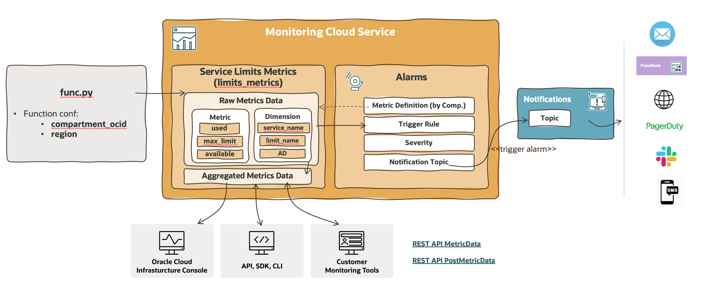
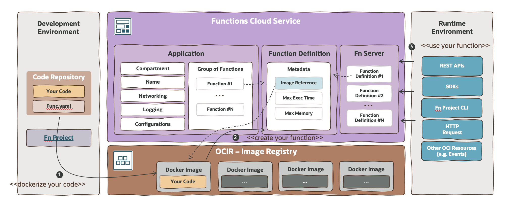

# Using OCI Functions to create OCI Monitoring custom metric namespace: Services Limit monitoring example use case

Reviewed: 15.11.2023

## 1. INTRODUCTION

Describes how any user can create an OCI Monitoring ***custom metric namespace*** to be able to extend the default services metric namespaces. For that, we'll support on OCI Function written with Python SDK. To cover this educational example, we'll use as an example the creation of a custom metric namespace to monitor the OCI Services Limits usage. With this custom metric namespace, OCI alarms can be created and OCI Notification Service can be used to send the alarm information by different means to allow to create proactively a Service Limit Service Request to increase the limit before causing any disruption in the running services or services to be provisioned.

## 2. SOLUTION
We can see the overall architecture in the following logical diagram:



The OCI Functions service (Functions as a Service), has the following structure:



The function will take care of gathering the OCI Services Limits information and post as a custom metric namespace. The metrics where to post the data will be:

1. **used**: This is the amount of the Service Limit that it is being used
2. **max_limit**: This is the amount of the Service Limit that we can use (and increase with a SR)
3. **available**: This is the remaining amount of the Service Limit that we can use until get the max_limit
   
Not all the Services Limits are equal as they depend of the scope they have (Global, Regional or Availability Domain). We'll introduce the characteristics of a Service Limit as **Dimensions** of the metric, so we can select the Service Limit, the limit name and the scope to filter the specific limit. Thus, we'll have as **Dimensions**:

1. **service_name**: The name of the OCI Service that the Service Limit belongs to (e.g.: Compute)
2. **limit_name**: The name of the Service Limit (e.g.: bm-standard2-52-count)
3. **AD**: If the Service Limit has an AD availability, we can filter for the AD where we would like to filter the metric
 
With this raw data, we could be able to build Alarm Definitions on the specific Services Limits that we would like to monitor, as usually customers do not use all the possible OCI services.

Optionally, they could use any OCI Notification Service to be notified when the alarm fires receiving the notification message in any of the supported options. Some of them will enable the integration with 3rd party services.

## 3. FUNCTION'S LOGIC

Here we'll focus on reviewing the logic behind using the OCI Function Python SDK to get the objectives to monitor the Services Limits with OCI Monitoring.

We use 3 different OCI services API calls to gather the needed information to create the custom metric namespace for the Services Limit monitoring, these are:

1. [Identity and Access Management Service API](https://docs.oracle.com/en-us/iaas/api/#/en/identity/20160918/): To use the [ListAvailabilityDomains](https://docs.oracle.com/en-us/iaas/api/#/en/identity/20160918/AvailabilityDomain/ListAvailabilityDomains) API Call to get the list of the availability domains existing in the input tenancy.
2. [Monitoring API](https://docs.oracle.com/en-us/iaas/api/#/en/monitoring/20180401/): To use the [PostMetricData](https://docs.oracle.com/en-us/iaas/api/#/en/monitoring/20180401/MetricData/PostMetricData), to post the metrics information in the existing (or non yet existing) custom service metric namespace. If it doesn't exist yet, it just creates it so we don't need to explicitly create it before.
3. [Service Limits API](https://docs.oracle.com/en-us/iaas/api/#/en/limits/20181025/): To use the [ListLimitsDefinition](https://docs.oracle.com/en-us/iaas/api/#/en/limits/20181025/LimitDefinitionSummary/ListLimitDefinitions) to get the full list of Service Limits in a given compartment and the [GetResouceAvailability](https://docs.oracle.com/en-us/iaas/api/#/en/limits/20181025/ResourceAvailability/GetResourceAvailability), to gather the used and available limits depending in the scope (AD, regional, whole tenancy), of the known Service Limits from the previous list.
   
Basically, the **logic** is:

````
Start
Parse input arguments (compartment_ocid, region)
Setup the resource principals authentication signer
Initialise the clients for the different API calls (IAM, Monitoring, Service Limits)
Gather the full list of Service Limits Definitions sorted by Service Limit name
For the list of Service Limit names
    If the scope is Availability Domain
      For every AD
         Get the limits and usage for the Service Limit name within this AD
            Post in the custom metric namespace the metric with the dimension of the Service Limit, name and AD with the resources used, available and the service limit maximum
   For the non-AD Service Limit names (Global or Regional)
      Get the limits and usage for the Service Limit name 
            Post in the custom metric namespace the metric with the dimension of the Service Limit and name with the resources used, available and the service limit maximum
End
````

## 4. REQUIREMENTS

We have different requirements depending on the variant of this asset that we would use:

1. A **compartment** exists where to locate the Application: Will depend on your landing zone design. Typically monitoring applications/functions or integrations affecting the whole tenancy are located in the Security Compartment. 
   
2. A **VCN with a private subnet with Oracle Service Network (OSN) / Internet connectivity** exists: At the Application create time you'll need to choose a VCN and subnet that has the proper egress rule and route to gather the Oracle Service Network of your region through a Service Gateway and, if you're going to use the function in a given region X to gather the services limits on region Y, you'd need to have access to the Internet through a NAT Gateway. That's why the regional services access through Service Gateway only gives you access to the API endpoints of region X, not the Y.
   
3. The user must have the **proper permissions in a policy** to work with cloud-shell, container registry, logging service, functions as: 
   * Allow group <group-name> to use cloud-shell in tenancy
   * Allow group <group-name> to manage repos in compartment <your application compartment>
   * Allow group <group-name> to manage logging-family in compartment <your application compartment>
   * Allow group <group-name> to read metrics in tenancy
   * Allow group <group-name> to manage functions-family in compartment <your application compartment>
   * Allow group <group-name> to use virtual-network-family in tenancy


## 5. INPUT

The required function configuration parameters are:

* **compartment_ocid** with the OCID of your tenancy root compartment. 
* **region** where you want to get the Services Limits with regional scope and where to publish metrics

Others requirements:
* The **function's Timeout** must be configured with 120s, instead of the default of 30s to avoid getting timeout errors under certain circumstances.

## 6. OUTPUT

Every time the function is invoked, it will feed a custom metric namespace called "**limits_metric**" in the tenancy's root compartment with the information of the Services Limits usage.

You can check the custom metric extension from the OCI Metrics Explorer, where you will be able also to create alarms from a specific metric query.

## 7. GETTING STARTED

### 7.1 Create the application

Login in your tenancy and navigate from the menu to **Developer Services → Functions → Applications**.

Select the **region** where you want to create the OCI Function.

1. Click **Create Application**.
2. Specify:
   1. *app-monitoring* (or the one you wish) as the name for the new application.
   2. The VCN and subnet that the function will use.
   3. Click **Create**.

### 7.2 Set up your Cloud Shell dev environment
1. Click your newly created application *app-monitoring* to display the application details
2. Click **Getting Started → Cloud Shell Setup → Launch Cloud Shell**.
3. Set up Fn Project CLI context from the Cloud Shell Terminal:
   * Find the name of the pre-created Fn Project context of the region where you're creating the application:
      ````
      fn list context
      ````

   * Setup the Fn Project context:
      ````
      fn use context <region-context>
      e.g.:
      fn use context eu-amsterdam-1
      ````

   * Configure the Fn Project context with the OCID of the current compartment where we'll deploy the function:
      ````
      fn update context oracle.compartment-id <compartment-ocid>
      e.g.:
      fn update context oracle.compartment-id ocid1.compartment.oc1..aaaaaaaarvdfa72n...
      ````

   * Configure the Fn Project context with the OCI Registry address in the current region:
      ````
      fn update context registry <region-key>.ocir.io/<tenancy-namespace>/<repo-name-prefix>
      e.g.:
      fn update context registry ams.ocir.io/frxfz3gchXXX/app-monitoring
      ````
   
   * Configure the Fn Project context with the OCID of the compartment for a repository of images:
      ````
      fn update context oracle.image-compartment-id <compartment-ocid>
      e.g.:
      fn update context oracle.image-compartment-id ocid1.compartment.oc1..aaaaaaaaquqe______z2q
      ````

4. Generate the auth token:
   1. Click **Generate an Auth Token**, you'll gather the **Auth Tokens** page and click **Generate Token**.
   2. Enter a name for the token and click **Generate Token**. Copy the newly generated token secret in a safe location that you can retrieve later (the token will never be shown again in the console).
   3. Close **Generate Token** dialog.

5. Log in to Registry:
   1. On the Getting Started page, log in the Container Registry with the docker CLI command:
      ````
      docker login -u '<tenancy-namespace>/<user-name>' <region-key>.ocir.io
      e.g.: 
      docker login -u 'frxfz3gchXXX/oracleidentitycloudservice/john.doe@example.com' ams.ocir.io
      ````
   2. When prompted for a password, enter the OCI auth token that you created earlier.

### 7.3 Deploy the function

1. Create the nutshell of the function:
   ````
   fn init --runtime python servicelimits
   ````
   * A directory called *serviceLimits* is created
   * In the directory, you'll find the following files: requirements.txt, func.py and func.yaml

2. Replace the code with the code given:
   1. Click on the **Cloud Shell settings → Upload** → Drag and Drop the **func.py** and **requirements.txt** files on the upload windows → Upload
   * The files are available here [func.py](./files/Function/func.py) and [requirements.txt](./files/Function/requirements.txt)
  2. Move the files from your Cloud Shell home directory to the serviceLimits directory and replace the **func.py** and **requirements.txt** files

3. Deploy the function:
   1. In the Cloud Shell terminal, move to the serviceLimits directory, execute:
      ````
      fn -v deploy --app app-monitoring
      ````
   2. List the available apps:
      ````
      fn list functions app-monitoring
      ````

   3. Configure the function:
      1. Increase default timeout: **Developer Services → Applications** → Click on *app-monitoring* → **Functions** → Click on *servicelimits* → **Edit** → Change Timeout from 30s to 120s → **Save Changes**.
      2. In the **Resources** section → **Configuration**:
         1. Set as **key: compartment_ocid → value**: <your root tenancy OCID> → **+**
         2. Set as **key: region → value**: <region where you want to extract its services limits> → **+**

### 7.4 Invoke the function

#### 1. Cloud Shell

````
fn invoke app-monitoring servicelimits
e.g.:
fn invoke app-monitoring servicelimits
{'Result': 'OK'}
````

#### 2. OCI CLI
````
oci fn function invoke --function-id ocid1.fnfunc.oc1.eu-amsterdam-1.aaaaa... --body "" --file -
````

#### 3. Periodic execution using an "always true" alarm
1. **Create the Notification topic with OCI Function subscription: Menu → Developer Services → Notifications → Create Topic**
   1. **Name**: *tp-mon-functions*
   2. **Create**
   3. Select *tp-mon-functions* → **Create Subscription**
      1. **Protocol**: Function
      2. **Function compartment**: <your application compartment (usually shared security compartent)
      3. **Oracle Functions application**: *app-monitoring*
      4. **Function**: *servicelimits*
2. **Create the alarm definition: Menu → Observability & Management → Alarm Definitions → Create Alarm**:
   1. **Alarm name**: *al-runServicesLimitsFn*
   2. **Alarm severity**: Info
   3. **Alarm Body**: *Running serviceslimits function*
   4. **Compartment**: Select a compartment where the VCN that uses the function is created
   5. **Metric namespace**: oci_vcn
   6. **Metric name**: VnicContractUtilPercent
   7. **Internal**: 5 minute
   8. **Statistic**: Count
   9. **Trigger rule**:
      1.  **Operator**: greater than or equal to
      2.  **Value**: 1
      3.  **Trigger delay minutes**: 5
   10. **Destination service**: Notifications
   11. **Compartment**: <compartment where you've created the notification topic with functions subscription>
   12. **Topic**: *tp-mon-functions*
   13. **Repeat notification?** → Enabled
   14. **Notification frequency**: 5 minutes
   15. **Save alarm**

## 8.KNOWN PROBLEMS

None at this point.

## 9.RELEASE NOTES

2023-08-03 (version 0.1). Initial public release.
  
# License

Copyright (c) 2024 Oracle and/or its affiliates.

Licensed under the Universal Permissive License (UPL), Version 1.0.

See [LICENSE](https://github.com/oracle-devrel/technology-engineering/blob/main/LICENSE) for more details.
